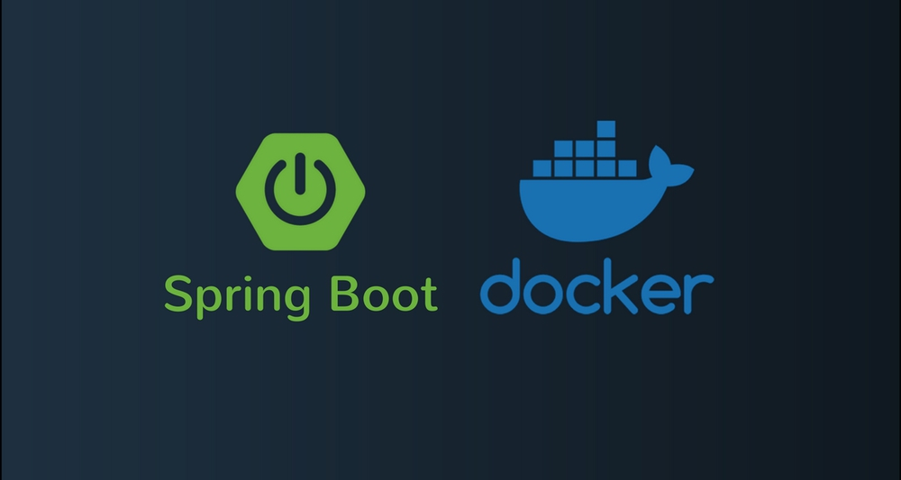
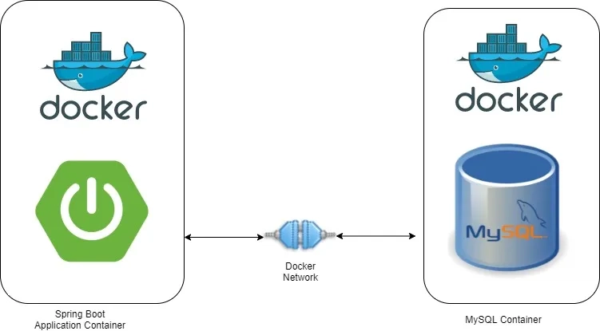

# API Spring Boot



## Descripción

Este repositorio contiene un **proyecto educativo** desarrollado con **Java** y **Spring Boot**, orientado a la construcción de una **API REST** moderna, funcional y estructurada bajo buenas prácticas de desarrollo backend.

El objetivo principal de este proyecto es **evidenciar conocimientos sólidos en backend**, especialmente en:

- **Java**
- **Spring Boot**
- **Diseño de APIs REST**
- **Persistencia con MySQL**
- **Uso de DTOs para transferencia de datos**
- **Buenas prácticas en la construcción del código**
- **Uso de Lombok para simplificar clases**
- **Dockerización de la aplicación**

Este proyecto representa un despliegue completo de una API REST, lo que demuestra capacidad para desarrollar soluciones backend listas para ser ejecutadas en entornos locales o contenerizados, como es en este caso.

## Tecnologías utilizadas

- Java
- Spring Boot
- Spring Web
- Spring Data JPA
- MySQL
- Docker
- Maven
- Lombok

## Características del proyecto

- API REST desarrollada con Spring Boot
- Arquitectura organizada por capas
- Separación de responsabilidades entre controladores, servicios, repositorios y DTOs
- Persistencia de datos con MySQL
- Transferencia de datos mediante **DTOs**
- Uso de Lombok para reducir código repetitivo y mejorar la legibilidad
- Código estructurado siguiendo buenas prácticas de desarrollo
- Aplicación dockerizada para facilitar su despliegue

## ¿Qué demuestra este proyecto?

Este proyecto demuestra conocimientos en:

### Backend
Capacidad para diseñar y desarrollar una API robusta, escalable y bien estructurada.

### Java
Dominio del lenguaje para implementar lógica de negocio clara, reutilizable y mantenible.

### Spring Boot
Uso del ecosistema Spring para construir servicios backend de forma eficiente.

### Base de datos MySQL
Integración con una base de datos relacional para almacenamiento y gestión de información.

### DTOs
Uso de objetos de transferencia de datos para evitar exponer directamente las entidades y mejorar la organización del código.

### Lombok
Uso de anotaciones para simplificar la construcción de clases, reduciendo código repetitivo y mejorando la mantenibilidad.

### Buenas prácticas
Aplicación de principios de limpieza de código, separación de capas y mantenibilidad.

### Docker
Contenerización del proyecto, lo que facilita su ejecución y despliegue en distintos entornos.

## Estructura general

La aplicación normalmente se organiza en capas como:

- `controller`: expone los endpoints de la API
- `service`: contiene la lógica de negocio
- `repository`: gestiona el acceso a datos
- `entity`: representa los modelos persistidos
- `dto`: maneja la transferencia de datos
- `config`: contiene configuraciones adicionales

Entre otras presentes en el proyecto.


## Valor académico

Este proyecto es una evidencia del aprendizaje y la práctica en el desarrollo backend con Java y Spring Boot. Además, al estar dockerizado, muestra una visión más completa y real del ciclo de vida de una aplicación, desde su construcción hasta su despliegue.


## Configuración del entorno




Antes de ejecutar la aplicación, asegúrate de tener configuradas las variables de entorno y credenciales necesarias para conectar con la base de datos.


### Ejemplo de configuración MySQL en `application.properties`

```properties
spring.application.name=apiSpringBoot

spring.datasource.url=${DB_URL}
spring.datasource.username=${DB_USERNAME}
spring.datasource.password=${DB_PASSWORD}
spring.datasource.driver-class-name=com.mysql.cj.jdbc.Driver

spring.jpa.hibernate.ddl-auto=update
spring.jpa.show-sql=true

server.port=8080
```


## Dockerización del proyecto

> **⚠️ Recomendación:** revisa y ajusta, en caso de ser necesario, los archivos `Dockerfile` y `docker-compose.yml` de acuerdo con las necesidades de tu entorno.


Para ejecutar y contenerizar este proyecto, se utilizan los archivos **Dockerfile** y **docker-compose.yml** presentes en el repositorio.

- **Dockerfile**: permite construir la imagen de la aplicación.
  
- **docker-compose.yml**: facilita la orquestación de los contenedores necesarios para levantar la API, como la base de datos y sus dependencias.


### Ejecución con Docker

1. Construye las imágenes del proyecto:
```bash

docker compose build
```

2. Levanta los contenedores
```bash

docker compose up -d
```

3. Verifica que los servicios estén corriendo correctamente.

4. La API quedará disponible según la configuración definidas en el docker-compose.yml.


## Agradecimientos

Agradezco a **TodoCode Academy** por su valioso contenido formativo, el cual contribuyó a mi aprendizaje y al desarrollo de este proyecto educativo.


## Autor

Desarrollado por SAMU0305.

